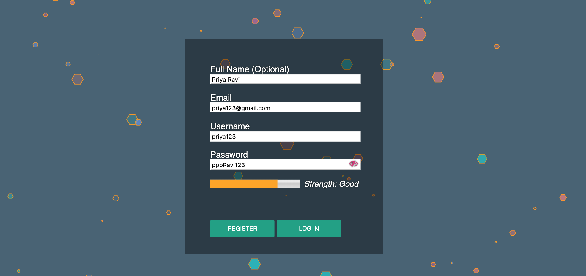
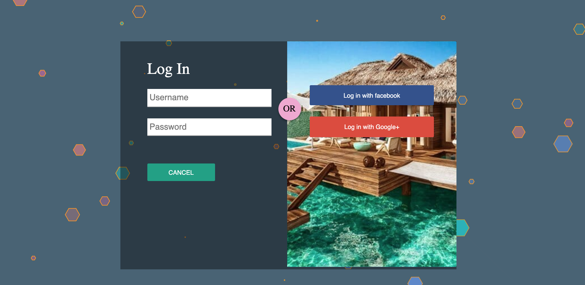
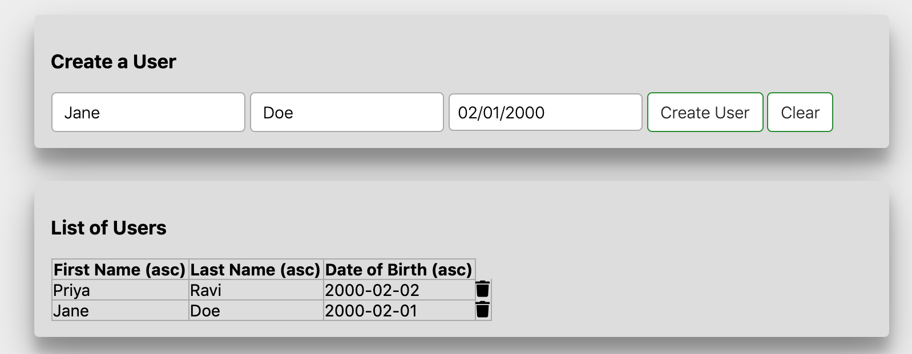
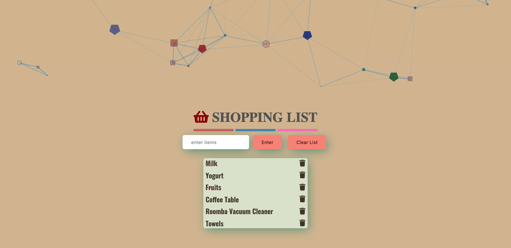
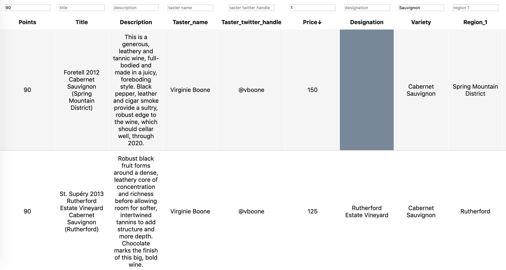
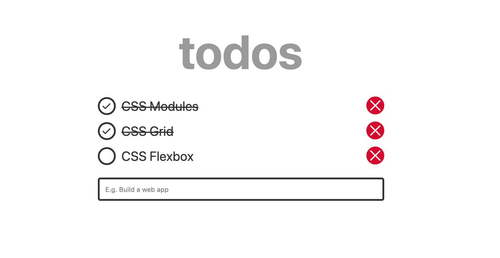
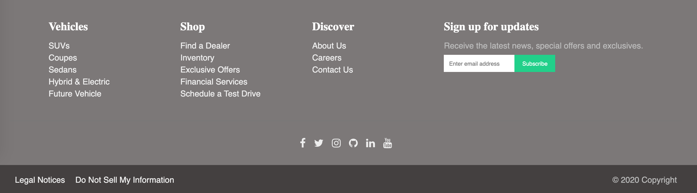
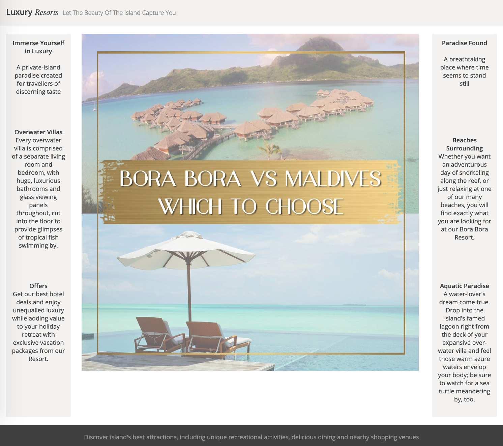
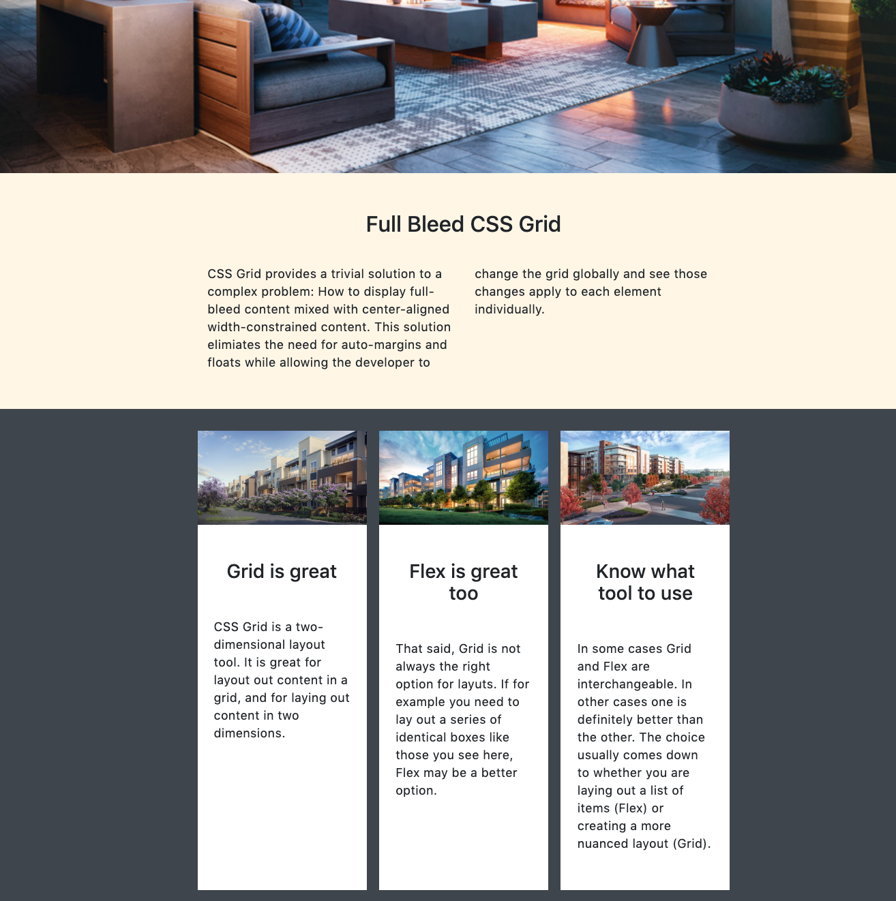

# dom-scripting
DOM Manipulation in Vanilla JavaScript

## Basics 
- Create a div and implement re-size functionality
- Create a div that moves with the mouse 

## Dom Querying 
- Use Dom Scripting to Extract data from websites 
   - https://www.mbusa.com/en/cpo
   - https://www.kbb.com/hatchback/
   - https://www.kbb.com/suv/
   
## Data Visualization using d3
- Load data and display it in the form of a line graph 
- Load data and display it in the form of a scatter plot

## React Dom
- Use map to Create React Components from Arrays of Data
- Make HTTP Requests with React
- Understand React.Children Utilities
- React.cloneElement to Extend Functionality of Children Components
- React's createElement API and JSX
- Normalize Events with Reacts Synthetic Event System
- Style React Components with className and In Line Styles
- Simple Reusable React Component
- Use the key prop when Rendering a List with React
- React Component Lifecycle Methods
- Validate Custom React Component Props with PropTypes
- Manipulate the DOM with React refs
- Stop Memory Leaks with componentWillUnmount Lifecycle Method in React
- Controlling Form Values with React

## Apps 

### Login Form 
- Implement a form to login and register user info 
- Validate user info
- Implement password strength
- Add functionality to show/hide password
- Use Particles.js for animation effects

 

### Users App
- Add a user (firstName, lastName, dateOfBirth)
- Sort users by name / date of birth
- Remove a user
- Clear the list of users

### Shopping List
- Add items to a list
- Delete individual items from the list
- Clear the list

### Wine Reviews
- Make an API call to fetch data
- Render the data in the form of a table on the UI 
- Sort data based on table header 
- Filter data based on user input 

### Todo List 

### Sticky Footer
- Keeping the footer at the bottom with CSS Flexbox
- https://css-tricks.com/snippets/css/a-guide-to-flexbox/
- https://css-tricks.com/couple-takes-sticky-footer/

#### Footer Structure
- main footer: four columns, with a newsletter signup form in the last column,
- social footer: six social icons centered on the page (this level won’t wrap),
- legal footer: three columns where the first two columns are positioned to the left, while the last column to the right of the screen.

 

### CSS Holy Grail Layout
- Sidebars and main content should have the same height, regardless of which element is the tallest,
- Sidebars should have fixed width and main content fluid width,
- The center column (main content) should appear first in the HTML source,
- If the content is sparse, the footer should stay to the bottom of the page,
- The layout should be responsive, all the sections should collapse into one column on smaller viewports
- https://alligator.io/css/css-grid-holy-grail-layout/

### CSS Grid Layout Using Bootstrap
- https://css-tricks.com/snippets/css/complete-guide-grid/

